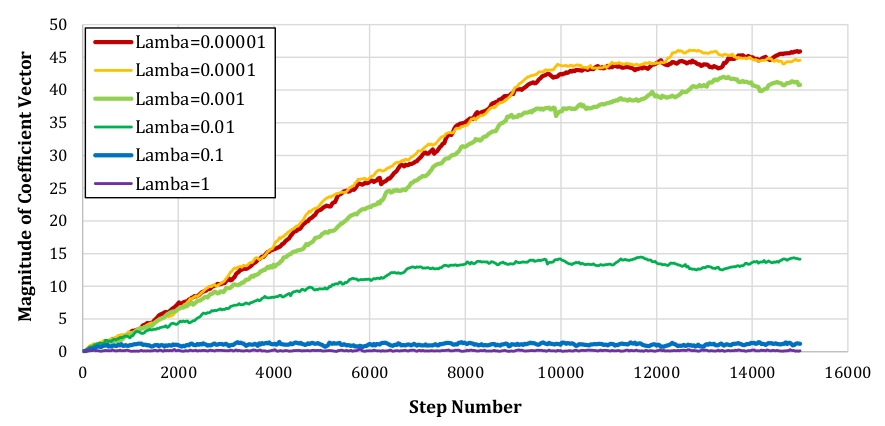
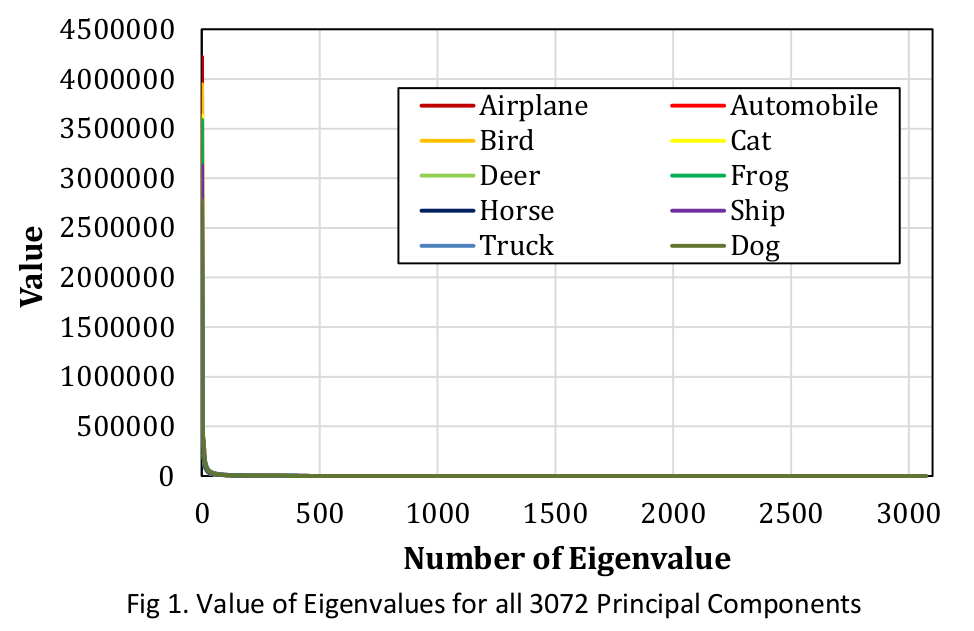
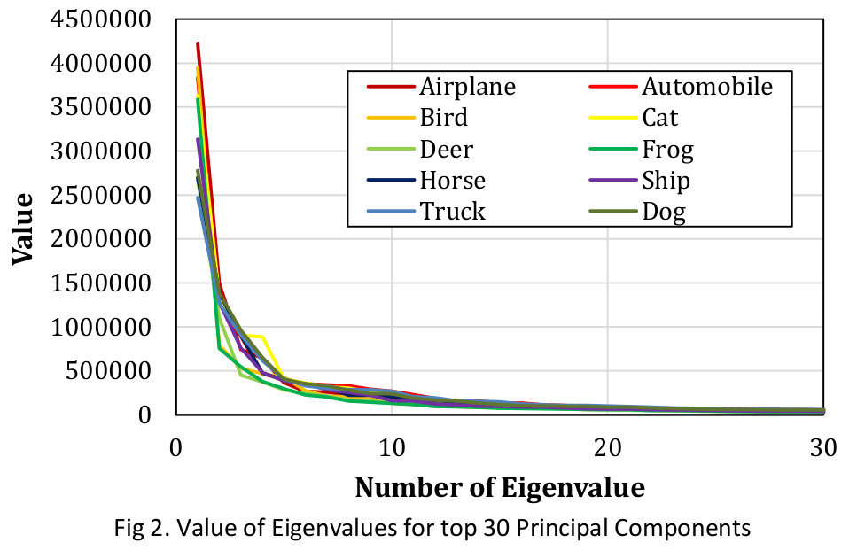
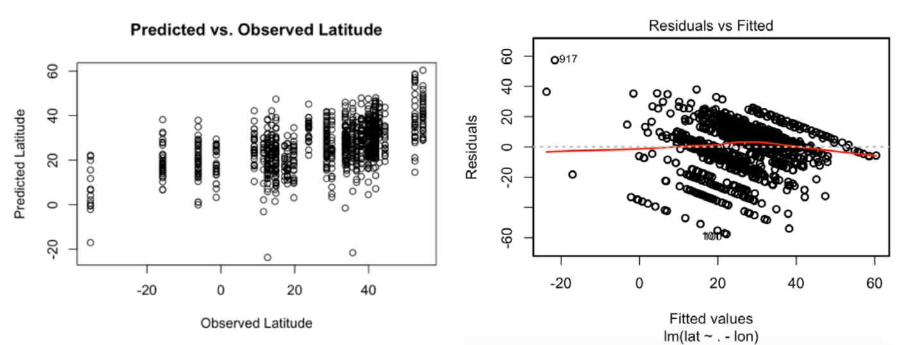
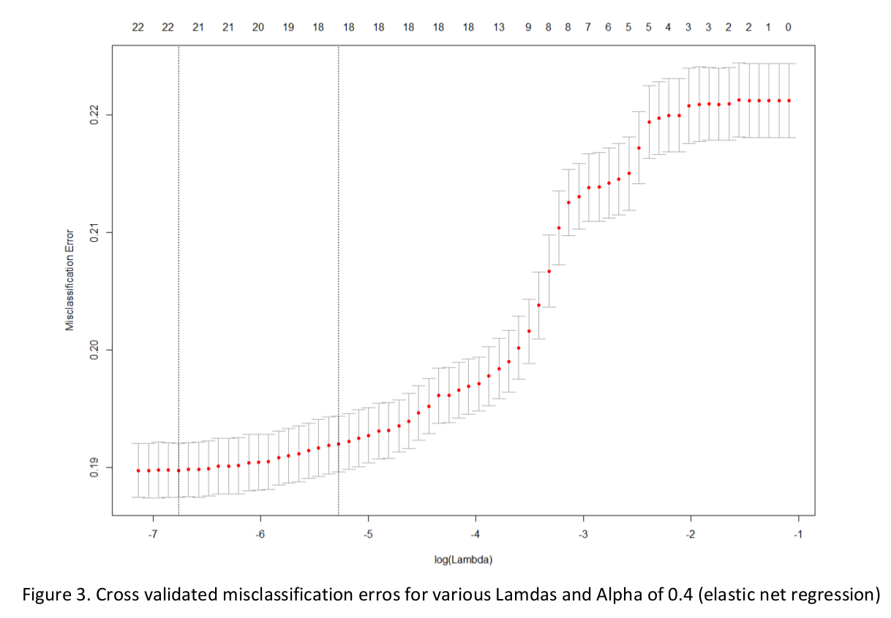
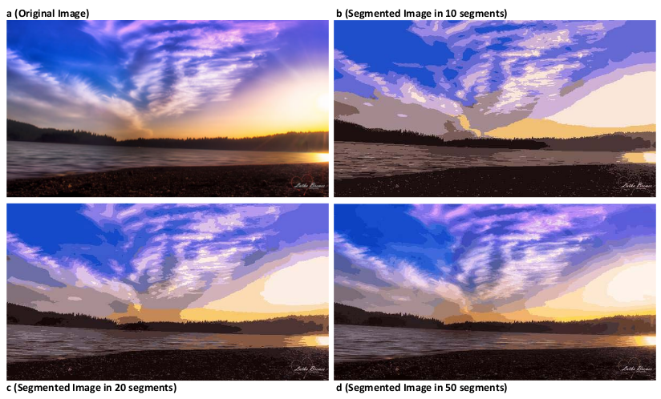

# Machine Learning Projects
 A collection of R and Python ML projects performed on real-world and practical datasets.

## Table of Contents
   * [What is this?](#what-is-this?)
   * [Naive Bayesian Analysis & Random Forrest](#Naive-Bayesian-Analysis-&-Random-Forrest)
   * [Support Vector Machine](#Support-Vector-Machine)
   * [Principal Components Analysis](#Principal-Components-Analysis)
   * [Linear & Logistic Regression](#Linear-&-Logistic-Regression)
   * [Expectation Maximization](#Expectation-Maximization)
   * [Authors](#Authors)

## What is this?

This is a collection of R and Python of various ML projects. Widely used and practical algorithms are developed with minimum dependency. These projects are conducted as assignments for the "Applied Machine Learning" Course taught at UIUC by Dr. Forsyth. The projects include a wide variety major ML algorithms conducted on real-world and practical datasets. This README only shows some examples of these projects. **For more details and source codes check the page for each project individually**.

## Naive Bayesian Analysis & Random Forrest
[UC Irvine data on diabetes patient](http://archive.ics.uci.edu/ml/datasets/Pima+Indians+Diabetes) are classified using a manually developed naive Bayes classifier as well as klaR and SVMLight packages for R. The case of patients with missing data are dealt using various methods and results are compared.

| Classifier        | Accuracy |          Note           |
| :---------------: |:--------:| :----------------------:|
| Naive Bayes       |   0.752  | Using dnorm () Function |
| Naive Bayes       |   0.748  | Replacing 0 values with "NA" |
| Naive Bayes       |   0.778  | Using klaR Library |
|         SVM       |   0.810  | Using SVMLight Library |

[MNIST](http://yann.lecun.com/exdb/mnist/) images are classified using Random Forrest method by h2o R Package.

| # of Trees        | Depth = 4 |          Depth = 8           | Depth = 16 |
| :---------------: |:--------:| :----------------------:| :--------------: |
| 10        |   0.85  | 0.93 | 0.96 |
| 20       |   0.87  | 0.94 | 0.96 |
| 30       |   0.87  | 0.94 | 0.97 |

[Source code and details](http://Naive-Bayesian-Analysis-&-Random-Forrest/)
## Support Vector Machine
A support vector machine is developed and trained on  ["UC Irvine data on adult income"](https://archive.ics.uci.edu/ml/datasets/Adult) using stochastic gradient descent with various regularization constants. 0.001 is chosen as the best regularization constant w/ an accuracy of 87% on test data.

## Principal Components Analysis
A PCA was performed on [CIFAR-10 dataset](https://www.cs.toronto.edu/~kriz/cifar.html). The first 20 principal components were computed and used for representing the images of each category. Each class is tried to be represented by PC of other classes and therefore, the similarities of all 10 classes are measured.

.

## Linear and Logistic Regression
[UCI dataset on features of music and latitude and longitude of their origins](https://archive.ics.uci.edu/ml/datasets/Geographical+Original+of+Music) is analyzed. A linear regression is developed for predicting the latitudes against features and is improved using Box-Cox transformation. Also, regularized regressions are developed using glmnet Package. Logistic regression are also developed on another [UCI dataset](http://archive.ics.uci.edu/ml/datasets/default+of+credit+card+clients) to predict a binary logistic classification.

## Expectation Maximization
Images are segmented using clustering. For this image pixels are clustered and then images are segmented by mapping each pixel to the cluster center with the highest value of the posterior probability for that pixel.

## Authors

- Behrooz Bajestani, moradi.bajestani@husky.neu.edu
- In cooperation of two other teammates from UIUC
